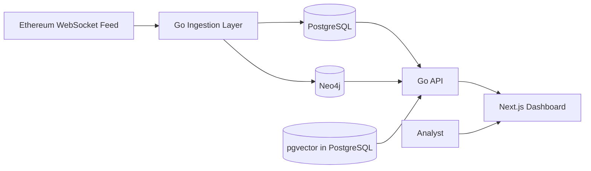
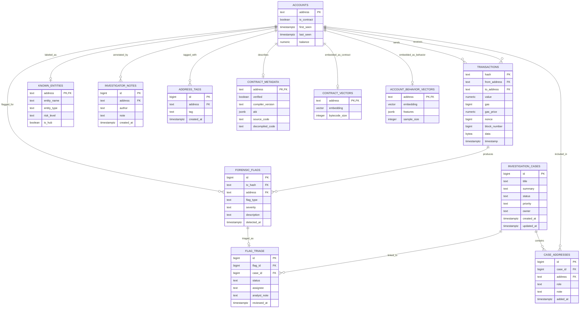

# Forensic Listener

## Concise Course Report

### Submission Metadata

| Field | Value |
| --- | --- |
| Student name | `[Insert student name]` |
| Student ID | `[Insert student ID]` |
| Course name / code | `[Insert course name and code]` |
| Professor / supervisor | `[Insert professor name]` |
| Submission date | `April 7, 2026` |
| Repository URL | `https://github.com/jonamarkin/forensic-listener` |
| Submitted commit | `ef7324c` |

---

## 1. Executive Summary

Forensic Listener is a database-centric Ethereum forensic investigation system.
The project was built to answer a database systems question:

> How should Ethereum forensic data be modeled when the application must
> support relational queries, graph traversal, and similarity search?

The final design uses:

- **PostgreSQL** for transactions, accounts, flags, notes, tags, cases, and
  contract metadata
- **Neo4j** for multi-hop tracing, hub discovery, and circular-flow analysis
- **pgvector** inside PostgreSQL for contract and behavior similarity

The implementation consists of a Go backend for ingestion and API delivery, and
a Next.js frontend for analyst workflows. The current system supports an
interactive overview dashboard, alert triage, account dossiers, hop-based graph
tracing, contract similarity, transaction investigation, and case management.

The system ingests live Ethereum transaction data through a WebSocket feed. In
addition, it bootstraps a small curated known-entity reference set so that
well-known tokens, routers, and hubs can be labeled from the beginning of an
investigation. This seeded reference layer improves interpretability, but it
does not replace live blockchain ingestion.

---

## 2. User Stories, Use Cases, Requirements, and Assumptions

### 2.1 Main Roles

| Role | Purpose in the system |
| --- | --- |
| Blockchain Investigator | Investigates addresses, transactions, and money flows |
| Compliance / Risk Analyst | Reviews and triages suspicious alerts |
| Smart Contract Analyst | Compares suspicious contracts and metadata |

### 2.2 User Stories and Use Cases

| Role | User story / use case | Status |
| --- | --- | --- |
| Investigator | Open an account dossier with counterparties, notes, tags, and recent transactions | Implemented |
| Investigator | Trace funds through a graph and inspect circular flows | Implemented |
| Investigator | Open a transaction investigation page and inspect linked flags | Implemented |
| Investigator | Create a case and attach addresses to it | Implemented |
| Analyst | Review recent flags and triage them with status, assignee, and note | Implemented |
| Analyst | Link a triaged flag to a case | Implemented |
| Contract analyst | Open a contract intelligence page and inspect similar contracts | Implemented |
| Analyst | Use watchlists and saved searches | Future |
| Multi-user team | Work with authentication, ownership, and role-based permissions | Future |

### 2.3 Functional Requirements

- ingest Ethereum transaction activity
- store accounts and transactions with relational integrity
- detect and store forensic flags
- support graph tracing and circular-flow analysis
- support contract and behavior similarity search
- support notes, tags, and investigation cases
- support alert triage and report export
- expose the system through a web interface

### 2.4 Assumptions

- the system is intended for analysts, not casual public users
- forensic flags are heuristic leads, not proof of wrongdoing
- similarity scores indicate resemblance, not identity
- graph results depend on the completeness of ingested transaction data
- curated entity labels are limited by the quality of the seed dataset

---

## 3. System Architecture and Implementation Overview

### 3.1 Architecture

### 3.2 Implementation Overview

| Layer | Main responsibility | Main implementation |
| --- | --- | --- |
| Ingestion | Reads Ethereum activity and persists it | [`main.go`](../main.go), [`ingestion/`](../ingestion) |
| Relational store | Accounts, transactions, flags, notes, tags, cases | [`store/postgres.go`](../store/postgres.go) |
| Graph store | Multi-hop paths, hubs, circular flows | [`store/neo4j.go`](../store/neo4j.go) |
| Vector search | Contract and behavior similarity | [`store/vector.go`](../store/vector.go) |
| API | Exposes routes for frontend and tools | [`api/server.go`](../api/server.go) |
| Frontend | Overview, alerts, graph, cases, dossiers, contracts, transactions | [`web/app/`](../web/app) |

### 3.3 Important Implemented Product Surfaces

- **Overview**: interactive dashboard with time-windowed transaction history and recent activity
- **Alerts**: forensic flags with triage status, assignee, notes, and case linking
- **Graph**: hop-based address tracing via Neo4j, with a center-node fallback when no neighborhood has been materialized yet
- **Accounts**: dossier view with notes, tags, counterparties, cases, and behavior similarity
- **Transactions**: transaction detail and linked flags
- **Contracts**: contract intelligence and similarity search
- **Cases**: investigation workflow and report export

---

## 4. Current Backlog

- watchlists and saved searches
- audit history for cases and triage actions
- richer curated entity coverage
- better contract metadata ingestion
- stronger graph cluster views
- authentication and role-based access control
- more automated tests and benchmarking

---

## 5. Database Schema (E-R Diagram, Keys, and Descriptions)

### 5.1 Why Multiple Databases Were Used

| Technology | Why it was used |
| --- | --- |
| PostgreSQL | Best fit for transactional integrity, constraints, and case-management data |
| Neo4j | Best fit for graph traversal, pathfinding, hub analysis, and circular flows |
| pgvector | Best fit for similarity search without introducing a separate vector service |

The system therefore combines two different types of data sources:

- **live data**: Ethereum transactions and derived forensic signals
- **curated reference data**: a small seeded set of known entities used for
  address labeling

### 5.2 PostgreSQL E-R Diagram

### 5.3 Main Keys and Constraints

| Table | Primary key | Important foreign keys / constraints |
| --- | --- | --- |
| `accounts` | `address` | Base entity table for addresses |
| `transactions` | `hash` | `from_address -> accounts.address`, `to_address -> accounts.address` |
| `forensic_flags` | `id` | `tx_hash -> transactions.hash`, `address -> accounts.address` |
| `known_entities` | `address` | One label row per address |
| `investigator_notes` | `id` | `address -> accounts.address` |
| `address_tags` | `id` | `address -> accounts.address`, unique `(address, tag)` |
| `contract_metadata` | `address` | `address -> accounts.address` |
| `contract_vectors` | `address` | `address -> accounts.address` |
| `account_behavior_vectors` | `address` | `address -> accounts.address` |
| `investigation_cases` | `id` | Status and priority are controlled workflow fields |
| `case_addresses` | `id` | `case_id -> investigation_cases.id`, `address -> accounts.address`, unique `(case_id, address)` |
| `flag_triage` | `id` | `flag_id -> forensic_flags.id`, `case_id -> investigation_cases.id` |

### 5.4 Graph and Vector Models

- **Neo4j graph model**:
  - nodes: `Account`
  - key property: `address`
  - relationships: directed transfer edges between accounts
- **pgvector usage**:
  - `contract_vectors` for bytecode similarity
  - `account_behavior_vectors` for behavioral similarity

---

## 6. Links to Code

### 6.1 Backend and Data Layer

- startup and orchestration: [`main.go`](../main.go)
- API routes: [`api/server.go`](../api/server.go)
- relational queries: [`store/postgres.go`](../store/postgres.go)
- graph queries: [`store/neo4j.go`](../store/neo4j.go)
- vector queries: [`store/vector.go`](../store/vector.go)
- flag explanations: [`api/flag_explanations.go`](../api/flag_explanations.go)
- case report export: [`api/reports.go`](../api/reports.go)

### 6.2 Schema

- base schema: [`migrations/000001_init_schema.up.sql`](../migrations/000001_init_schema.up.sql)
- enrichment queue: [`migrations/000002_enrichment_queue.up.sql`](../migrations/000002_enrichment_queue.up.sql)
- known entities: [`migrations/000003_known_entities.up.sql`](../migrations/000003_known_entities.up.sql)
- intelligence surfaces: [`migrations/000004_intelligence_surfaces.up.sql`](../migrations/000004_intelligence_surfaces.up.sql)
- case workflows: [`migrations/000005_case_workflows.up.sql`](../migrations/000005_case_workflows.up.sql)

### 6.3 Frontend

- overview: [`web/app/overview/page.tsx`](../web/app/overview/page.tsx)
- alerts: [`web/app/alerts/page.tsx`](../web/app/alerts/page.tsx)
- graph: [`web/app/graph/page.tsx`](../web/app/graph/page.tsx)
- account dossier: [`web/app/accounts/[address]/page.tsx`](../web/app/accounts/[address]/page.tsx)
- transaction investigation: [`web/app/transactions/[hash]/page.tsx`](../web/app/transactions/[hash]/page.tsx)
- cases: [`web/app/cases/page.tsx`](../web/app/cases/page.tsx)

---

## 7. Test Case Specifications

| ID | Test case | Procedure | Expected result |
| --- | --- | --- | --- |
| T1 | Backend build | Run `go build ./...` | Backend compiles successfully |
| T2 | Frontend build | Run `pnpm build` in `web/` | Frontend compiles successfully |
| T3 | Health route | Request `GET /health` | Returns API status JSON |
| T4 | Account dossier | Request `GET /accounts/{address}/profile` | Returns account aggregates, notes, tags, and cases |
| T5 | Graph neighborhood | Request `GET /addresses/{address}/graph` | Returns a Neo4j neighborhood when available, otherwise a center-node fallback if the account exists in PostgreSQL |
| T6 | Graph trace | Request `GET /addresses/{address}/trace?...` | Returns bounded path if available |
| T7 | Alert triage | Request `POST /flags/{id}/triage` | Triage state is stored |
| T8 | Case creation | Request `POST /cases` | New case is created |
| T9 | Case export | Request `GET /cases/{id}/report` | Markdown report downloads |
| T10 | Contract similarity | Request `GET /contracts/{address}/similar` | Similar contracts are returned |
| T11 | Transaction investigation | Open `/transactions/[hash]` | Transaction detail and linked flags are shown |

---

## 8. System Limitations and Possibilities for Improvement

### 8.1 Current Limitations

- curated reference coverage is still limited even though transaction activity is ingested live
- watchlists and saved searches are not yet implemented
- authentication and role-based access control are not yet implemented
- multi-user collaboration is not yet implemented
- graph clustering beyond single-address tracing is not yet implemented
- graph completeness still depends on Neo4j ingestion; when a neighborhood is missing, the interface falls back to a center node only
- automated tests and formal query benchmarks are still limited
- forensic flags and similarity outputs are heuristic, not definitive proof

### 8.2 Improvements

- add watchlists and saved searches
- add audit history for case and triage actions
- expand known-entity coverage
- improve contract metadata ingestion
- add stronger graph cluster views
- add authentication and multi-user permissions
- add more automated testing and benchmarking

---

## 9. Conclusion

Forensic Listener is a database systems project built around a real forensic use
case. Its main contribution is showing how relational, graph, and vector models
can be combined in one application:

- PostgreSQL answers structured ledger and workflow questions
- Neo4j answers multi-hop connection questions
- pgvector answers similarity questions

The system is already usable as a prototype for analyst workflows, and it also
demonstrates the database design decisions, trade-offs, and schema modeling
expected in a database course project.
