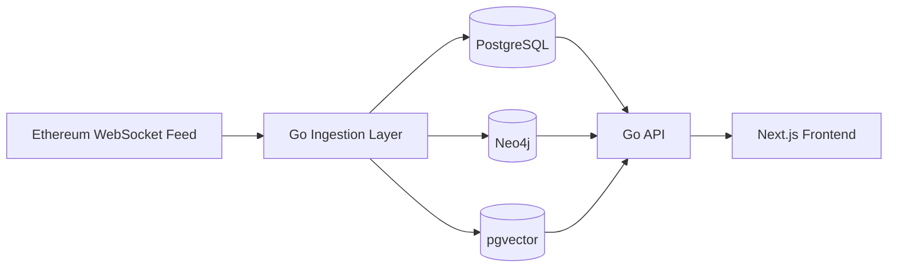
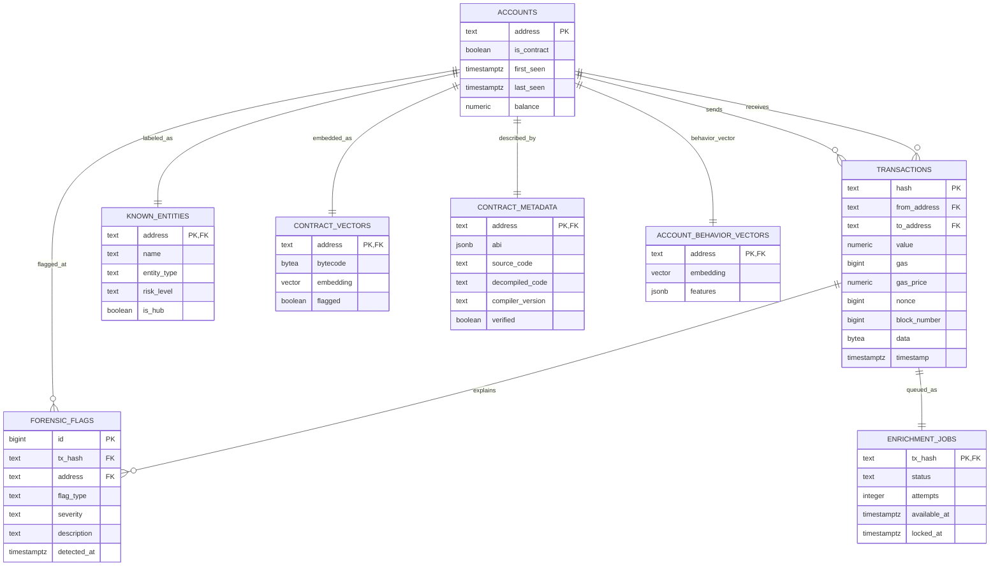

# Forensic Listener

## Concise Course Report

### Submission Metadata

| Field | Value |
| --- | --- |
| Student name | `[Insert student name]` |
| Student ID | `[Insert student ID]` |
| Course name / code | `[Insert course name and code]` |
| Professor / supervisor | `[Insert professor name]` |
| Submission date | `April 14, 2026` |
| Repository URL | `https://github.com/jonamarkin/forensic-listener` |
| Submitted commit | `[Insert final commit hash]` |

---

## 1. Executive Summary

Forensic Listener is an Ethereum investigation application built as a database
systems project. The project answers one core question:

> How should Ethereum forensic data be modeled when the application must support
> relational queries, graph traversal, and similarity search in the same
> system?

The final design uses three complementary data technologies:

- **PostgreSQL** as the source of truth for transactions, accounts, forensic
  flags, contract metadata, and enrichment state
- **Neo4j** for multi-hop tracing, hub discovery, and circular-flow detection
- **pgvector** inside PostgreSQL for contract-bytecode similarity and account
  behavior similarity

The system ingests live Ethereum transaction data over WebSocket. It also seeds
a small known-entity reference set so that major tokens, routers, and hubs can
be labeled early. The current application surface is intentionally simple:
overview dashboard, account profile, transaction detail, graph workspace, and
contract analysis.

---

## 2. User Stories, Use Cases, Requirements, and Assumptions

### 2.1 Main Roles

| Role | Purpose |
| --- | --- |
| Blockchain Investigator | Reviews addresses, transactions, and money movement |
| Smart Contract Analyst | Reviews contract metadata and similarity results |
| System Operator | Verifies that ingestion and enrichment are working |

### 2.2 User Stories and Use Cases

| Role | User story / use case | Status |
| --- | --- | --- |
| Investigator | Open the overview dashboard and inspect recent activity and recent forensic flags | Implemented |
| Investigator | Open an account profile and inspect counterparties, recent transactions, and behavior similarity | Implemented |
| Investigator | Trace an address in the graph and inspect hop-based paths and circular flows | Implemented |
| Investigator | Open a transaction page and inspect payload, counterparties, and linked flags | Implemented |
| Contract analyst | Open a contract page and inspect bytecode, metadata, and similar contracts | Implemented |
| Operator | Confirm ingestion freshness and enrichment status from the overview data | Implemented |
| Investigator | Use watchlists and saved searches | Future |
| Multi-user team | Work with authentication and role-based permissions | Future |

### 2.3 Functional Requirements

- ingest live Ethereum transactions
- store accounts, transactions, and flags with relational integrity
- classify contract addresses using on-chain bytecode lookup
- maintain a graph model for hop-based tracing
- support vector similarity for accounts and contracts
- expose the results through a web application

### 2.4 Assumptions

- the system is intended for analysts, not casual public users
- forensic flags are heuristic signals, not proof of wrongdoing
- similarity scores indicate resemblance, not identity
- graph results depend on the subset of Ethereum activity that has been ingested
- known-entity labels depend on the quality of the seeded reference set

---

## 3. System Architecture and Implementation Overview

### 3.1 Architecture

### 3.2 Implementation Overview

| Layer | Main responsibility | Main implementation |
| --- | --- | --- |
| Ingestion | Reads Ethereum transactions and persists them | [`main.go`](../main.go), [`ingestion/worker_pool.go`](../ingestion/worker_pool.go), [`client/eth.go`](../client/eth.go) |
| Relational store | Accounts, transactions, flags, contract metadata, enrichment queue | [`store/postgres.go`](../store/postgres.go) |
| Graph store | Address graph, shortest traces, hubs, circular flows | [`store/neo4j.go`](../store/neo4j.go) |
| Vector search | Contract and behavior similarity | [`store/vector.go`](../store/vector.go) |
| API | Exposes the backend data to the frontend | [`api/server.go`](../api/server.go) |
| Frontend | Overview, account, graph, transaction, and contract pages | [`web/app/`](../web/app) |

### 3.3 Current Product Surfaces

- **Overview**: summary metrics, transaction history, recent flags, recent transactions
- **Account profile**: account summary, counterparties, recent transactions, behavior similarity, velocity chart
- **Graph workspace**: hop-based tracing, center-node fallback, hub list, path tracing
- **Transaction detail**: ledger event view with counterparties, payload, and linked flags
- **Contract analysis**: recent contracts, contract detail, bytecode-based similarity

### 3.4 Important Design Decisions

- **PostgreSQL first**: every transaction is written to PostgreSQL before slower enrichment work runs
- **Neo4j as a secondary store**: graph queries are eventually consistent with the relational source of truth
- **pgvector inside PostgreSQL**: similarity search stays inside the same database platform instead of adding a fourth service
- **Known-entity seed set**: a small curated reference catalog improves interpretability without replacing live data

---

## 4. Current Backlog

- richer known-entity coverage
- better contract metadata ingestion
- watchlists and saved searches
- improved graph cluster views
- authentication and role-based access control
- more automated tests and performance benchmarking

---

## 5. Database Schema (E-R Diagram, Keys, and Descriptions)

### 5.1 Why Multiple Databases Were Used

| Technology | Why it was used |
| --- | --- |
| PostgreSQL | transactional integrity, foreign keys, constraints, metrics, and source-of-truth storage |
| Neo4j | pathfinding, neighborhood expansion, hubs, and circular-flow queries |
| pgvector | nearest-neighbor search for contracts and behavioral profiles |

### 5.2 PostgreSQL E-R Diagram

### 5.3 Table Descriptions and Keys

| Table | Primary key | Important foreign keys / notes |
| --- | --- | --- |
| `accounts` | `address` | parent table for observed Ethereum addresses |
| `transactions` | `hash` | `from_address -> accounts.address`, `to_address -> accounts.address` |
| `forensic_flags` | `id` | `tx_hash -> transactions.hash`, `address -> accounts.address` |
| `enrichment_jobs` | `tx_hash` | `tx_hash -> transactions.hash`; durable queue for async enrichment |
| `known_entities` | `address` | `address -> accounts.address`; seeded reference labels |
| `contract_vectors` | `address` | `address -> accounts.address`; stores bytecode and vector embedding |
| `contract_metadata` | `address` | `address -> accounts.address`; semi-structured ABI stored as `JSONB` |
| `account_behavior_vectors` | `address` | `address -> accounts.address`; stores behavior embedding and features |

### 5.4 Design Quality

- the relational core is normalized around `accounts`, `transactions`, and `forensic_flags`
- PostgreSQL transactions are used on the write path, so the relational source of truth is ACID
- Neo4j and pgvector are updated asynchronously, so the overall polyglot system is eventually consistent outside PostgreSQL
- `JSONB` is used only where semi-structured data is justified, especially contract ABI and behavior features

---

## 6. Links to Code

- application entry point: [`main.go`](../main.go)
- Ethereum WebSocket client: [`client/eth.go`](../client/eth.go)
- ingestion pipeline: [`ingestion/worker_pool.go`](../ingestion/worker_pool.go)
- PostgreSQL store: [`store/postgres.go`](../store/postgres.go)
- Neo4j store: [`store/neo4j.go`](../store/neo4j.go)
- pgvector store: [`store/vector.go`](../store/vector.go)
- circular-flow detector: [`forensics/circular.go`](../forensics/circular.go)
- bytecode anomaly detector: [`forensics/anomaly.go`](../forensics/anomaly.go)
- HTTP API: [`api/server.go`](../api/server.go)
- frontend routes: [`web/app/overview/page.tsx`](../web/app/overview/page.tsx), [`web/app/accounts/[address]/page.tsx`](../web/app/accounts/[address]/page.tsx), [`web/app/graph/page.tsx`](../web/app/graph/page.tsx), [`web/app/transactions/[hash]/page.tsx`](../web/app/transactions/[hash]/page.tsx), [`web/app/contracts/page.tsx`](../web/app/contracts/page.tsx), [`web/app/contracts/[address]/page.tsx`](../web/app/contracts/[address]/page.tsx)

---

## 7. Test Case Specifications

| ID | Area | Test case | Expected result |
| --- | --- | --- | --- |
| T1 | Build | Run `go build ./...` | Backend compiles successfully |
| T2 | Build | Run `pnpm build` in `web/` | Frontend compiles successfully |
| T3 | Overview API | Request `GET /stats/overview` | Returns transaction, account, contract, and flag counts |
| T4 | Account profile | Request `GET /accounts/{address}/profile` | Returns account aggregates, counterparties, and recent transactions |
| T5 | Graph | Request `GET /addresses/{address}/graph` | Returns a graph neighborhood or a center-node fallback |
| T6 | Trace | Request `GET /addresses/{address}/trace?to={target}` | Returns a bounded hop path if one exists |
| T7 | Transaction detail | Request `GET /transactions/{hash}` and `GET /transactions/{hash}/flags` | Returns ledger detail and linked flags |
| T8 | Contract queue | Request `GET /contracts/recent` | Returns recently observed contract accounts |
| T9 | Contract similarity | Request `GET /contracts/{address}/similar` | Returns nearest-neighbor contract matches |
| T10 | Behavior similarity | Request `GET /accounts/{address}/similar` | Returns nearest-neighbor account matches |

---

## 8. Limitations and Possibilities for Improvement

### 8.1 Current Limitations

- the system only covers the subset of Ethereum activity that has been ingested
- graph and vector stores are enrichment layers, so they may briefly lag behind PostgreSQL
- contract metadata depth depends on what has been populated in `contract_metadata`
- similarity outputs are investigative leads, not conclusive attribution
- the current product is single-user and does not yet include authentication

### 8.2 Improvements

- add broader known-entity coverage and better labeling provenance
- add richer contract decoding and metadata ingestion
- add watchlists, saved searches, and user authentication
- add more benchmark results for graph and vector query performance
- add more automated end-to-end tests against the API and UI
