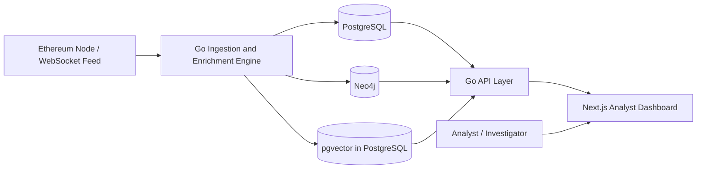
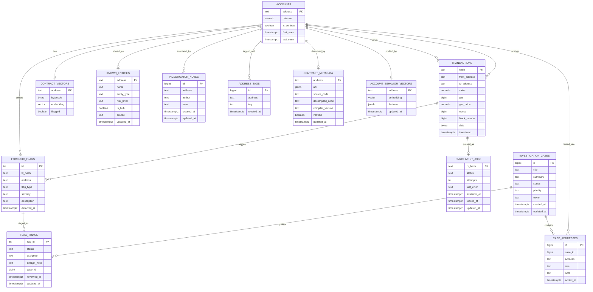
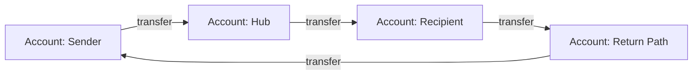

# Forensic Listener

## Submission Report

### Database Systems Project

### Submission Metadata

Fill in the personal course details below before the final submission upload.

| Field | Value |
| --- | --- |
| Student name | `[Insert student name]` |
| Student ID | `[Insert student ID]` |
| Course name / code | `[Insert course name and code]` |
| Professor / supervisor | `[Insert professor name]` |
| Submission date | `April 7, 2026` |
| Repository URL | `https://github.com/jonamarkin/forensic-listener` |
| Submitted commit | `ef7324c` |

**Project theme:** Ethereum forensic investigation system using polyglot persistence  
**Primary academic focus:** database design, schema design, data modeling, indexing, and query architecture  
**Repository:** [`forensic-listener`](../)  

---

### Course Documentation Checklist

The report below matches the required course documentation items as follows:

| Required item from course brief | Where it appears in this report |
| --- | --- |
| Executive summary | Section 1 |
| User stories, use-cases, requirements, assumptions | Sections 4 to 8 |
| System architecture description and implementation overview | Sections 9 to 16 |
| Current backlog | Section 19 |
| Database schema (E-R diagram) with key descriptions | Sections 12 to 14 |
| Links to code | Section 23 |
| Test case specifications | Section 18 |
| System limitations and possibilities for improvement | Sections 20 to 21 |

Sections 2 and 3 are included as supporting context so that a third-party
reader understands the problem and product scope before the detailed technical
material begins.

---

## 1. Executive Summary

Forensic Listener is a database-centric Ethereum monitoring and investigation
system. The project was designed to answer a database engineering question:

> How should an Ethereum forensic application model its data when it must
> support relational ledger queries, graph traversal, and similarity search at
> the same time?

The final system combines three complementary storage models:

- **PostgreSQL** as the relational source of truth for accounts, transactions,
  forensic flags, case management, notes, tags, and contract metadata
- **Neo4j** as the graph engine for multi-hop transaction tracing, hub
  detection, and circular-flow analysis
- **pgvector** inside PostgreSQL for similarity search over contract bytecode
  and account behavior

The application exposes these capabilities through:

- a **Go backend** responsible for ingestion, enrichment, API delivery, and
  database coordination
- a **Next.js frontend** that presents the data as an investigator workspace
  rather than a generic blockchain explorer

The system is now usable as an analyst-oriented prototype. An investigator can
search an address, inspect a dossier, trace flows in a graph, review suspicious
alerts, triage those alerts, and save work into investigation cases. The
project is therefore not only a technical database exercise but also a coherent
forensic product demonstration.

---

## 2. Problem Statement

Ethereum activity is naturally heterogeneous:

- transaction ledgers are tabular and benefit from relational integrity
- movement of value across addresses is naturally graph-shaped
- similarity between contracts or behavior profiles is a nearest-neighbor
  problem

A single database model is not ideal for all of these workloads.

The goal of the project was therefore to build a system that:

1. ingests Ethereum transaction activity in near real time
2. stores structured ledger data with strong integrity guarantees
3. supports multi-hop tracing and circular path analysis
4. supports similarity search for forensic leads
5. provides an analyst workflow for investigation and triage

---

## 3. Product Scope

### 3.1 Product Positioning

Forensic Listener is best described as:

**An Ethereum forensic investigation workspace for analysts, built on a
polyglot database architecture.**

It is **not** positioned as:

- a public blockchain explorer for casual users
- a compliance decision engine that automatically determines guilt
- a fully mature commercial platform with multi-tenant collaboration

### 3.2 Main Value Proposition

The value of the system is that it joins three important forensic capabilities
in one workspace:

- structured transaction and account analysis
- graph-based flow tracing
- similarity-driven investigative leads

---

## 4. User Roles

### 4.1 Primary Roles

#### Blockchain Investigator

This is the main target user of the product.

The investigator needs to:

- open an address dossier
- inspect counterparties and recent activity
- trace funds across multiple hops
- review suspicious flags
- save notes and tags
- build and maintain a case

#### Compliance / Risk Analyst

This role uses the system primarily for prioritization and review.

The analyst needs to:

- review recent alerts
- assess severity and context
- assign and triage flags
- link alerts to investigation cases
- determine what should be escalated, monitored, or dismissed

### 4.2 Secondary Roles

#### Smart Contract / Threat Analyst

This role focuses on contract inspection and similarity analysis.

The contract analyst needs to:

- open a contract intelligence page
- inspect bytecode and metadata
- compare similar contracts
- identify suspicious families or cloned deployments

#### System Operator

This role monitors the technical health of the ingestion and enrichment system.

The operator needs to:

- monitor ingestion freshness
- inspect enrichment backlog
- confirm that stream data is flowing
- observe overall system health

---

## 5. User Stories

### 5.1 Blockchain Investigator

- As a blockchain investigator, I want to open an address dossier so that I can
  quickly understand whether the address is worth deeper investigation.
- As a blockchain investigator, I want to trace multi-hop flows so that I can
  follow where funds moved after leaving a suspicious address.
- As a blockchain investigator, I want to inspect circular paths so that I can
  identify suspicious return flows and possible wash movement.
- As a blockchain investigator, I want to create and update cases so that my
  investigative work is preserved and not lost between sessions.
- As a blockchain investigator, I want to attach addresses to cases so that
  clusters of related addresses are tracked together.
- As a blockchain investigator, I want to open a transaction as its own
  investigation page so that I can inspect the payload, counterparties, and any
  linked flags.

### 5.2 Compliance / Risk Analyst

- As a compliance analyst, I want to review recent forensic flags so that I can
  prioritize suspicious activity quickly.
- As a compliance analyst, I want to triage a flag by assigning it, annotating
  it, and linking it to a case so that the review process becomes structured.
- As a compliance analyst, I want to understand why a flag was raised so that I
  can judge whether it is a strong lead or weak signal.
- As a compliance analyst, I want to inspect velocity anomalies and entity
  labels so that I can distinguish likely normal activity from suspicious
  behavior.

### 5.3 Smart Contract / Threat Analyst

- As a smart contract analyst, I want to inspect a contract profile so that I
  can understand whether a contract is verified, suspicious, or related to
  previously observed patterns.
- As a smart contract analyst, I want to compare similar contracts so that I
  can identify cloned or reused suspicious bytecode families.

### 5.4 System Operator

- As a system operator, I want to monitor health, queue depth, and recent
  activity so that I know whether the forensic pipeline is functioning
  correctly.

---

## 6. Use Cases

### 6.1 Implemented Core Use Cases

| Use case | Main role | Status |
| --- | --- | --- |
| Open account dossier | Investigator | Implemented |
| Review recent alerts | Analyst | Implemented |
| Triage alert | Analyst | Implemented |
| Create investigation case | Investigator | Implemented |
| Attach address to case | Investigator | Implemented |
| Export case report | Investigator | Implemented |
| Trace address in graph | Investigator | Implemented |
| Review circular flows | Investigator / Analyst | Implemented |
| Inspect contract similarity | Contract analyst | Implemented |
| Inspect transaction detail | Investigator | Implemented |

### 6.2 Partially Implemented or Limited Use Cases

| Use case | Status | Notes |
| --- | --- | --- |
| Entity labeling at scale | Partial | Seeded labels exist, but curated coverage is still limited |
| Collaboration with multiple users | Partial | Cases and triage exist, but no real user accounts or RBAC yet |
| Contract metadata deep analysis | Partial | Metadata model exists, but coverage depends on ingestion depth |
| Behavior-based attribution | Partial | Similarity exists, but it should be treated as a lead, not proof |

### 6.3 Future Use Cases

| Use case | Status |
| --- | --- |
| Watchlists and saved searches | Future |
| Audit history and comments timeline | Future |
| True multi-user authentication and authorization | Future |
| Address clustering beyond single-address analysis | Future |
| Advanced evidence packaging | Future |

---

## 7. Requirements

### 7.1 Functional Requirements

- ingest Ethereum transactions from a live WebSocket source
- persist accounts and transactions relationally
- detect and store forensic flags
- support investigation notes and tags
- support known entity labeling
- support graph tracing and circular path analysis
- support contract and behavior similarity search
- support alert triage
- support investigation cases
- support transaction-level investigation
- provide a web interface for these workflows

### 7.2 Non-Functional Requirements

- maintain relational integrity through foreign keys and uniqueness rules
- allow efficient recent-activity queries through indexing
- support graph traversal for multi-hop analysis
- support approximate similarity search without a separate vector service
- allow live monitoring through API and stream routes
- remain deployable as a local lab-style system with a clear architecture

---

## 8. Assumptions and Non-Goals

### 8.1 Assumptions

- the system is used by analysts rather than casual users
- forensic flags are heuristic leads, not legal conclusions
- similarity scores indicate resemblance, not identity
- graph results are only as complete as the ingested transaction data
- entity labels are only as strong as the available curated dataset

### 8.2 Non-Goals

- fully automated fraud adjudication
- definitive attribution of real-world identity
- public consumer blockchain browsing
- high-scale commercial multi-tenant production SaaS

---

## 9. System Architecture

### 9.1 High-Level Architecture

### 9.2 Architectural Overview

The system is split into five main layers:

1. **Ethereum ingestion layer**
   - subscribes to live Ethereum activity
   - parses and forwards transaction data

2. **Relational intelligence layer**
   - stores accounts, transactions, flags, notes, tags, cases, and metadata
   - acts as the source of truth

3. **Graph analysis layer**
   - stores transfer relationships for flow analysis
   - supports path, hub, and circular-flow queries

4. **Similarity layer**
   - stores embeddings for bytecode and behavior
   - supports nearest-neighbor search

5. **Presentation layer**
   - routes investigators through overview, alerts, graph, contracts, accounts,
     transactions, and cases

---

## 10. Infrastructure Overview

### 10.1 Runtime Components

The implemented system currently uses:

- **PostgreSQL** on port `5432`
- **Neo4j** on port `7687`
- **Ethereum WebSocket endpoint** on port `8546`
- **Go API** on port `8080`
- **Next.js frontend** on port `3000`

### 10.2 Configuration

Important environment-controlled values include:

- `POSTGRES_URL`
- `POSTGRES_MIGRATIONS_URL`
- `NEO4J_URL`
- `NEO4J_USER`
- `NEO4J_PASSWORD`
- `ETH_WS_URL`
- `API_ADDR`
- `API_AUTH_TOKEN`
- `API_ALLOW_ORIGIN`

These are initialized in [`main.go`](../main.go).

### 10.3 Why This Infrastructure Was Chosen

- simple enough to run locally for academic demonstration
- explicit separation of database responsibilities
- easy to inspect and explain during evaluation
- does not require a large cloud platform to understand the system design

---

## 11. Database Architecture and Rationale

### 11.1 Why PostgreSQL Was Used

PostgreSQL is the relational source of truth because the project needs:

- primary keys and foreign keys
- transactional consistency
- indexing for frequent queries
- constraint enforcement
- normalized case and intelligence workflows
- support for `JSONB` where limited schema flexibility is useful

This makes PostgreSQL the right place for:

- `accounts`
- `transactions`
- `forensic_flags`
- `enrichment_jobs`
- `known_entities`
- `investigator_notes`
- `address_tags`
- `contract_metadata`
- `investigation_cases`
- `case_addresses`
- `flag_triage`

### 11.2 Why Neo4j Was Used

Neo4j was chosen because multi-hop flow tracing is naturally a graph problem.

Typical forensic graph questions include:

- what is the neighborhood around this address?
- is there a path between address A and address B?
- does value return to the original address?
- which addresses behave like hubs?

These queries are awkward in plain SQL and map naturally to a graph database.

### 11.3 Why pgvector Was Used

The project needs similarity search for:

- smart contract bytecode
- account behavior profiles

Using `pgvector` inside PostgreSQL keeps similarity search close to the rest of
the relational intelligence layer and avoids the need for a separate vector
service.

### 11.4 Why MongoDB Was Not Used

MongoDB was intentionally not introduced because:

- the project already had PostgreSQL for structured storage
- the limited semi-structured data needed could be represented with `JSONB`
- adding a fourth database would increase operational complexity without adding
  proportional academic value

`JSONB` is used selectively for:

- `contract_metadata.abi`
- `account_behavior_vectors.features`

---

## 12. PostgreSQL Schema

### 12.1 Main Tables

- `accounts`
- `transactions`
- `contract_vectors`
- `forensic_flags`
- `enrichment_jobs`
- `known_entities`
- `investigator_notes`
- `address_tags`
- `contract_metadata`
- `account_behavior_vectors`
- `investigation_cases`
- `case_addresses`
- `flag_triage`

### 12.2 E-R Diagram

### 12.3 Key Design Decisions

#### Primary Keys

- `accounts.address`
- `transactions.hash`
- `contract_vectors.address`
- `contract_metadata.address`
- `account_behavior_vectors.address`
- `known_entities.address`
- `investigation_cases.id`
- `case_addresses.id`
- `forensic_flags.id`
- `flag_triage.flag_id`

#### Foreign Keys

- transactions reference accounts
- flags reference transactions and/or accounts
- notes and tags reference accounts
- vector tables reference accounts
- case tables reference cases, accounts, and flags

#### Important Constraints

- severity domain constraint on `forensic_flags.severity`
- risk-level domain constraint on `known_entities.risk_level`
- unique signal constraint on `(tx_hash, address, flag_type)`
- unique tag constraint on `(address, tag)`
- unique case membership constraint on `(case_id, address)`
- controlled status enums for cases and triage

#### Important Indexes

- `transactions(from_address)`
- `transactions(to_address)`
- `transactions(block_number)`
- `forensic_flags(address)`
- `known_entities(entity_type, is_hub, risk_level)`
- `enrichment_jobs(status, available_at, locked_at)`
- recent-order indexes for notes, tags, cases, and triage

---

## 13. Neo4j Graph Model

### 13.1 Graph Representation

- node label: `Account`
- node identity property: `address`
- relationship: transfer-like movement between addresses

### 13.2 Graph Model Diagram

This representation makes it possible to query:

- address neighborhoods
- bounded trace paths
- recent circular flows
- top hubs by degree

### 13.3 Why This Graph Exists Alongside PostgreSQL

The relational layer stores transaction truth; the graph layer stores
relationship structure for efficient traversal.

This is a deliberate separation of concerns:

- PostgreSQL answers **what happened**
- Neo4j answers **how things are connected**

---

## 14. pgvector Design

### 14.1 Contract Similarity

The `contract_vectors` table stores:

- contract address
- bytecode
- vector embedding
- flagged indicator

This supports similarity queries such as:

- “Which deployed contracts are most similar to this one?”

### 14.2 Behavioral Similarity

The `account_behavior_vectors` table stores:

- address
- vector embedding
- `features JSONB`
- update timestamp

This supports similarity queries such as:

- “Which accounts behave similarly to this account?”

### 14.3 Why These Features Matter

Similarity is not treated as proof. It is used as an **investigative lead
generator** to help analysts discover potentially related behavior or reused
contract families.

---

## 15. Implementation Overview

### 15.1 Backend

The Go backend is responsible for:

- ingestion startup and service orchestration in [`main.go`](../main.go)
- API delivery in [`api/server.go`](../api/server.go)
- relational queries in [`store/postgres.go`](../store/postgres.go)
- graph queries in [`store/neo4j.go`](../store/neo4j.go)
- vector similarity in [`store/vector.go`](../store/vector.go)
- alert explanation logic in [`api/flag_explanations.go`](../api/flag_explanations.go)
- case report export in [`api/reports.go`](../api/reports.go)

### 15.2 Frontend

The Next.js frontend is organized by investigative surface:

- overview: [`web/app/overview/page.tsx`](../web/app/overview/page.tsx)
- graph: [`web/app/graph/page.tsx`](../web/app/graph/page.tsx)
- alerts: [`web/app/alerts/page.tsx`](../web/app/alerts/page.tsx)
- cases: [`web/app/cases/page.tsx`](../web/app/cases/page.tsx)
- case detail: [`web/app/cases/[id]/page.tsx`](../web/app/cases/[id]/page.tsx)
- account dossier: [`web/app/accounts/[address]/page.tsx`](../web/app/accounts/[address]/page.tsx)
- contract intelligence: [`web/app/contracts/[address]/page.tsx`](../web/app/contracts/[address]/page.tsx)
- transaction investigation: [`web/app/transactions/[hash]/page.tsx`](../web/app/transactions/[hash]/page.tsx)

### 15.3 Product Workflow Surfaces

- overview dashboard: [`web/components/dashboard/overview-live-surface.tsx`](../web/components/dashboard/overview-live-surface.tsx)
- triage workflow: [`web/components/dashboard/alerts-live-surface.tsx`](../web/components/dashboard/alerts-live-surface.tsx)
- graph workspace: [`web/components/dashboard/graph-map.tsx`](../web/components/dashboard/graph-map.tsx)
- case workflow: [`web/components/dashboard/cases-surface.tsx`](../web/components/dashboard/cases-surface.tsx)
- case detail workflow: [`web/components/dashboard/case-detail-surface.tsx`](../web/components/dashboard/case-detail-surface.tsx)
- dossier workbench: [`web/components/dashboard/case-workbench.tsx`](../web/components/dashboard/case-workbench.tsx)

---

## 16. API Overview

### 16.1 Core Routes

#### Transactions

- `GET /transactions`
- `GET /transactions/{hash}`
- `GET /transactions/{hash}/flags`

#### Accounts

- `GET /accounts/{address}`
- `GET /accounts/{address}/profile`
- `POST /accounts/{address}/notes`
- `POST /accounts/{address}/tags`
- `GET /accounts/{address}/behavior`
- `GET /accounts/{address}/similar`
- `GET /accounts/{address}/velocity`

#### Cases

- `GET /cases`
- `POST /cases`
- `GET /cases/{id}`
- `POST /cases/{id}`
- `POST /cases/{id}/addresses`
- `GET /cases/{id}/report`

#### Graph / Neo4j

- `GET /addresses/{address}/graph`
- `GET /addresses/{address}/trace`
- `GET /entities/hubs`
- `GET /forensics/circular`

#### Contracts

- `GET /contracts/recent`
- `GET /contracts/{address}`
- `GET /contracts/{address}/similar`

#### Alerts and Metrics

- `GET /flags`
- `POST /flags/{id}/triage`
- `GET /stats/overview`
- `GET /stats/enrichment`
- `GET /stats/flags`
- `GET /stats/network`
- `GET /alerts/velocity`
- `GET /stream/events`

---

## 17. How the Product Is Used

### 17.1 Suggested Demonstration Flow

This is the recommended route for a live demonstration to a lecturer or other
external reviewer:

1. Open **Overview** and explain that it is built from relational aggregates in
   PostgreSQL plus live backend metrics, including the time-windowed
   transaction-history chart.
2. Open **Alerts** and show that flags can be triaged rather than only viewed.
3. Update a flag with status, assignee, note, and optional case link.
4. Pivot into the linked **Account Dossier** and explain how notes, tags,
   counterparties, recent transactions, and behavior features are assembled.
5. Open **Flow Canvas** and demonstrate hop-based graph tracing through Neo4j.
   If a neighborhood has not yet been materialized, explain that the interface
   now falls back to a center node rather than appearing empty.
6. Open a **Transaction Investigation** page and show linked flags and context.
7. Open **Cases** and export a markdown **Case Report**.

### 17.2 Typical Analyst Flow

1. Open **Overview** to monitor health, recent activity, and suspicious pressure.
2. Open **Alerts** to inspect recent raised flags.
3. Triage a flag by assigning it, annotating it, and optionally linking it to a
   case.
4. Open the linked **Account Dossier** to inspect counterparties, notes, tags,
   behavior profile, and velocity.
5. Pivot into **Flow Canvas** for graph tracing and path analysis.
6. Open or update a **Case** so the investigation becomes persistent.
7. Export a **Case Report** when a summary artifact is needed.

### 17.3 Why This Is Useful in the Current State

The system is already useful for:

- suspicious-address triage
- manual forensic review
- case-oriented investigation
- graph exploration
- contract comparison
- demonstrating how multiple database models solve different query classes

---

## 18. Test Case Specifications

The project currently relies mainly on build verification, route testing, and
manual workflow testing rather than a large automated test suite.

### 18.1 Test Cases

| ID | Test case | Steps | Expected result |
| --- | --- | --- | --- |
| T1 | Build backend | Run `go build ./...` | Backend compiles successfully |
| T2 | Build frontend | Run `pnpm build` in `web/` | Frontend compiles successfully |
| T3 | Health endpoint | Request `GET /health` | Returns API status JSON |
| T4 | Recent transactions | Request `GET /transactions` | Returns recent transaction list |
| T5 | Account dossier | Request `GET /accounts/{address}/profile` | Returns dossier with aggregates, tags, notes, and cases |
| T6 | Graph neighborhood | Request `GET /addresses/{address}/graph` | Returns a Neo4j neighborhood when available, otherwise a center-node fallback if the account exists in PostgreSQL |
| T7 | Graph trace | Request `GET /addresses/{address}/trace?...` | Returns bounded path if available |
| T8 | Contract similarity | Request `GET /contracts/{address}/similar` | Returns nearest contract matches |
| T9 | Case creation | `POST /cases` | New case is created and returned |
| T10 | Alert triage | `POST /flags/{id}/triage` | Flag triage state is updated |
| T11 | Transaction investigation | Open `/transactions/[hash]` | Transaction details and linked flags are shown |
| T12 | Case export | Request `GET /cases/{id}/report` | Markdown report downloads |
| T13 | Stream events | Request `GET /stream/events` | Snapshot stream is emitted |

### 18.2 Verification Performed During Development

The implemented system has been repeatedly verified through:

- Go build success
- Next.js production build success
- direct API route checks with `curl`
- live route validation after restarting stale processes
- end-to-end checks for cases and flag triage

### 18.3 Testing Limitation

There is currently limited automated unit and integration test coverage. This
is a realistic limitation and part of the current backlog.

---

## 19. Current Backlog

The following items are the most meaningful next improvements:

### 19.1 High Priority

- watchlists and saved searches
- audit trail / comments history
- richer curated entity import and management
- more detailed contract metadata ingestion
- improved explainability for behavior similarity

### 19.2 Medium Priority

- evidence packaging beyond markdown report export
- stronger graph cluster views
- query benchmarking and performance measurement
- administrative observability pages

### 19.3 Longer-Term / Advanced

- user authentication
- role-based access control
- multi-user collaboration
- clustering beyond single-address analysis
- stronger entity-resolution pipelines

---

## 20. Limitations

The current implementation has several important limitations.

### 20.1 Product Limitations

- curated reference coverage is still limited even though blockchain activity is ingested live
- watchlists and saved-search workflows are not yet implemented
- user authentication and authorization are not yet implemented
- multi-user collaboration is not yet implemented
- clustering beyond single-address investigation is not yet implemented

### 20.2 Analytical Limitations

- forensic flags are heuristic signals, not proof
- behavior similarity indicates resemblance, not identity
- contract similarity indicates bytecode resemblance, not intent
- graph completeness depends on Neo4j ingestion completeness; when a neighborhood is missing, the interface falls back to a center node only

### 20.3 Engineering Limitations

- automated test coverage is still limited
- there is not yet a formal benchmark section for query performance
- some product workflows remain prototype-grade rather than fully production
  hardened

---

## 21. Possibilities for Improvement

The project can be improved in several ways:

- expand curated entity coverage for exchanges, bridges, mixers, and protocols
- add watchlists and saved searches
- add full audit history on cases and triage actions
- add authentication, ownership, and multi-user permissions
- improve contract ingestion and explainability
- add graph-based clustering and case-level cluster summaries
- add stronger test automation and benchmarking
- add more polished export/reporting features

---

## 22. Key Design Decisions and Trade-Offs

### Decision 1: Use PostgreSQL as the source of truth

**Why:** The project needs integrity, transactions, constraints, indexing, and
normalized data models.

**Trade-off:** Some graph-shaped queries are not ideal in SQL, which motivated
the Neo4j layer.

### Decision 2: Use Neo4j only for graph problems

**Why:** Multi-hop tracing and circular paths are graph-native problems.

**Trade-off:** The system becomes more operationally complex because it now has
multiple databases.

### Decision 3: Use pgvector instead of a separate vector store

**Why:** It keeps similarity search close to the relational intelligence layer
and simplifies deployment.

**Trade-off:** It is less specialized than running a dedicated vector database
service, but much simpler and more coherent for this academic system.

### Decision 4: Do not add MongoDB

**Why:** The semi-structured requirements were limited and handled well by
`JSONB`.

**Trade-off:** PostgreSQL remains responsible for both rigid relational data and
small semi-structured fragments, but this was acceptable and much simpler.

### Decision 5: Separate Go API and Next.js frontend

**Why:** The backend is the engine for ingestion and database coordination; the
frontend is a routed analyst workspace.

**Trade-off:** Two application runtimes must be deployed, but responsibilities
become clearer.

---

## 23. Code Links

### 23.1 Repository Traceability

- canonical repository URL: `https://github.com/jonamarkin/forensic-listener`
- submitted commit for this report snapshot: `ef7324c`

### Backend

- startup and orchestration: [`main.go`](../main.go)
- API routes: [`api/server.go`](../api/server.go)
- relational queries: [`store/postgres.go`](../store/postgres.go)
- graph queries: [`store/neo4j.go`](../store/neo4j.go)
- vector queries: [`store/vector.go`](../store/vector.go)
- alert explanations: [`api/flag_explanations.go`](../api/flag_explanations.go)
- case report export: [`api/reports.go`](../api/reports.go)

### Schema

- base schema: [`migrations/000001_init_schema.up.sql`](../migrations/000001_init_schema.up.sql)
- enrichment queue: [`migrations/000002_enrichment_queue.up.sql`](../migrations/000002_enrichment_queue.up.sql)
- known entities: [`migrations/000003_known_entities.up.sql`](../migrations/000003_known_entities.up.sql)
- intelligence surfaces: [`migrations/000004_intelligence_surfaces.up.sql`](../migrations/000004_intelligence_surfaces.up.sql)
- case workflows: [`migrations/000005_case_workflows.up.sql`](../migrations/000005_case_workflows.up.sql)

### Frontend

- overview: [`web/app/overview/page.tsx`](../web/app/overview/page.tsx)
- alerts: [`web/app/alerts/page.tsx`](../web/app/alerts/page.tsx)
- cases: [`web/app/cases/page.tsx`](../web/app/cases/page.tsx)
- account dossier: [`web/app/accounts/[address]/page.tsx`](../web/app/accounts/[address]/page.tsx)
- transaction investigation: [`web/app/transactions/[hash]/page.tsx`](../web/app/transactions/[hash]/page.tsx)
- flow canvas: [`web/app/graph/page.tsx`](../web/app/graph/page.tsx)

### 23.2 Submission Asset Checklist

For a final PDF or LMS upload, the following additions are recommended:

- export the Mermaid diagrams as static images in case the grading viewer does
  not render Mermaid
- include screenshots of:
  - Overview
  - Alerts with triage controls visible
  - Graph / Flow Canvas
  - Account Dossier
  - Cases or Case Report export
- keep the repository URL and submitted commit hash together with the report so
  the code version is unambiguous

---

## 24. Conclusion

Forensic Listener demonstrates that a forensic Ethereum application benefits
from using more than one database model.

The project shows, in an implemented system, that:

- relational databases are well suited to ledgers, integrity, and case records
- graph databases are well suited to transaction-flow analysis
- vector extensions are well suited to similarity-driven investigative leads

The final outcome is therefore both:

- a **database systems project**
- and a **usable investigation-oriented prototype**

That combination is the main contribution of the work.
