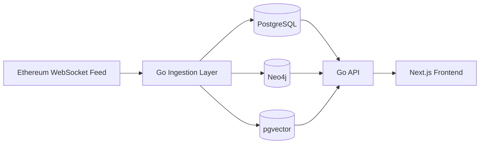
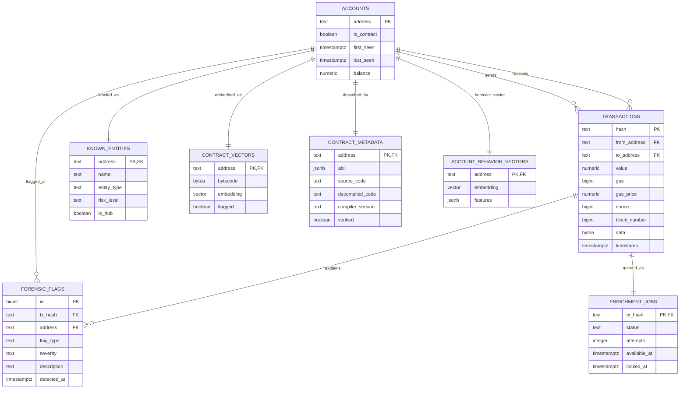

# Forensic Listener

## Submission Report

### Database Systems Project

### Submission Metadata

| Field | Value |
| --- | --- |
| Student name | `[Insert student name]` |
| Student ID | `[Insert student ID]` |
| Course name / code | `[Insert course name and code]` |
| Professor / supervisor | `[Insert professor name]` |
| Submission date | `April 14, 2026` |
| Repository URL | `https://github.com/jonamarkin/forensic-listener` |
| Submitted commit | `[Insert final commit hash]` |

---

## 1. Executive Summary

Forensic Listener is an Ethereum investigation application designed to
demonstrate how different database models solve different parts of the same
problem. The system ingests live Ethereum transactions and then answers three
classes of questions:

- **What happened?**  
  PostgreSQL stores accounts, transactions, forensic flags, contract metadata,
  and enrichment state.
- **How are addresses connected?**  
  Neo4j stores the address graph and supports hop-based tracing, hub discovery,
  and circular-flow queries.
- **What looks similar?**  
  pgvector inside PostgreSQL supports nearest-neighbor search for contract
  bytecode and account behavior.

The submitted application intentionally keeps the interface simple. The main
pages are the overview dashboard, account profile, transaction detail, graph
workspace, and contract analysis.

---

## 2. User Roles, Use Cases, Requirements, and Assumptions

### 2.1 Roles

| Role | Purpose |
| --- | --- |
| Blockchain Investigator | Investigates addresses, transactions, and flow paths |
| Smart Contract Analyst | Reviews contracts and similarity results |
| System Operator | Monitors ingestion freshness and enrichment health |

### 2.2 Implemented Use Cases

| Use case | Main role | Status |
| --- | --- | --- |
| Review overview metrics and recent flags | Investigator / Operator | Implemented |
| Open an account profile with counterparties and recent transactions | Investigator | Implemented |
| Trace an address through a hop-based graph | Investigator | Implemented |
| Inspect a single transaction and its linked flags | Investigator | Implemented |
| Inspect recent contracts and similar contracts | Contract analyst | Implemented |
| Inspect behaviorally similar accounts | Investigator | Implemented |

### 2.3 Functional Requirements

- ingest live Ethereum transactions
- preserve relational integrity for accounts and transactions
- classify contracts using on-chain bytecode lookup
- maintain a graph model for tracing and circular-path detection
- maintain vector-based similarity search for accounts and contracts
- expose the results through a web interface

### 2.4 Assumptions

- the system is designed for analyst use, not casual browsing
- forensic flags are heuristic signals, not legal conclusions
- similarity indicates resemblance, not identity
- graph results depend on the completeness of ingested activity
- the seeded known-entity catalog is a small reference layer, not the main dataset

---

## 3. System Architecture and Implementation Overview

| Layer | Main responsibility | Main implementation |
| --- | --- | --- |
| Ingestion | Reads Ethereum activity and writes the source-of-truth transaction record first | [`main.go`](../main.go), [`ingestion/worker_pool.go`](../ingestion/worker_pool.go), [`client/eth.go`](../client/eth.go) |
| PostgreSQL store | Accounts, transactions, flags, metadata, enrichment queue | [`store/postgres.go`](../store/postgres.go) |
| Neo4j store | Graph neighborhoods, traces, hubs, circular flows | [`store/neo4j.go`](../store/neo4j.go) |
| pgvector layer | Contract and account similarity | [`store/vector.go`](../store/vector.go) |
| API | Backend routes consumed by the frontend | [`api/server.go`](../api/server.go) |
| Frontend | Overview, account, graph, transaction, and contract pages | [`web/app/`](../web/app) |

### Current Product Surfaces

- `/overview`
- `/accounts/[address]`
- `/graph`
- `/transactions/[hash]`
- `/contracts`
- `/contracts/[address]`

---

## 4. Current Backlog

- richer known-entity coverage
- more contract metadata ingestion
- watchlists and saved searches
- improved graph cluster views
- authentication and role-based access control
- additional automated tests and benchmarks

---

## 5. Database Schema (E-R Diagram, Keys, and Descriptions)

### 5.1 Database Choices

| Database technology | Purpose |
| --- | --- |
| PostgreSQL | source of truth, integrity, constraints, metrics, and structured queries |
| Neo4j | graph-native tracing and path queries |
| pgvector | nearest-neighbor similarity inside PostgreSQL |

### 5.2 PostgreSQL E-R Diagram

### 5.3 Key Identification

| Table | Primary key | Important foreign keys / notes |
| --- | --- | --- |
| `accounts` | `address` | parent relation for observed addresses |
| `transactions` | `hash` | `from_address -> accounts.address`, `to_address -> accounts.address` |
| `forensic_flags` | `id` | `tx_hash -> transactions.hash`, `address -> accounts.address` |
| `enrichment_jobs` | `tx_hash` | `tx_hash -> transactions.hash`; durable queue model |
| `known_entities` | `address` | `address -> accounts.address`; seeded labels |
| `contract_vectors` | `address` | `address -> accounts.address`; vector-backed contract features |
| `contract_metadata` | `address` | `address -> accounts.address`; ABI stored as `JSONB` |
| `account_behavior_vectors` | `address` | `address -> accounts.address`; behavior embedding and features |

### 5.4 Design Rationale

- PostgreSQL is the ACID source of truth.
- Neo4j is a specialized secondary store for graph workloads.
- pgvector stays inside PostgreSQL to avoid a separate vector service.
- Contract ABI and behavior features use `JSONB` because they are semi-structured.
- The polyglot system is eventually consistent across stores because graph and vector enrichment run asynchronously after the PostgreSQL write succeeds.

---

## 6. Links to Code

- [`main.go`](../main.go)
- [`client/eth.go`](../client/eth.go)
- [`ingestion/worker_pool.go`](../ingestion/worker_pool.go)
- [`store/postgres.go`](../store/postgres.go)
- [`store/neo4j.go`](../store/neo4j.go)
- [`store/vector.go`](../store/vector.go)
- [`forensics/circular.go`](../forensics/circular.go)
- [`forensics/anomaly.go`](../forensics/anomaly.go)
- [`api/server.go`](../api/server.go)
- [`web/app/overview/page.tsx`](../web/app/overview/page.tsx)
- [`web/app/accounts/[address]/page.tsx`](../web/app/accounts/[address]/page.tsx)
- [`web/app/graph/page.tsx`](../web/app/graph/page.tsx)
- [`web/app/transactions/[hash]/page.tsx`](../web/app/transactions/[hash]/page.tsx)
- [`web/app/contracts/page.tsx`](../web/app/contracts/page.tsx)
- [`web/app/contracts/[address]/page.tsx`](../web/app/contracts/[address]/page.tsx)

---

## 7. Test Case Specifications

| ID | Area | Test case | Expected result |
| --- | --- | --- | --- |
| T1 | Backend build | Run `go build ./...` | Backend compiles |
| T2 | Frontend build | Run `pnpm build` in `web/` | Frontend compiles |
| T3 | Overview API | Request `GET /stats/overview` | Returns core counters |
| T4 | Account profile | Request `GET /accounts/{address}/profile` | Returns profile aggregates and recent transactions |
| T5 | Graph | Request `GET /addresses/{address}/graph` | Returns graph data or center-node fallback |
| T6 | Trace | Request `GET /addresses/{address}/trace?to={target}` | Returns a bounded path if one exists |
| T7 | Transactions | Request `GET /transactions/{hash}` and `GET /transactions/{hash}/flags` | Returns ledger detail and related flags |
| T8 | Contracts | Request `GET /contracts/recent` and `GET /contracts/{address}` | Returns contract summaries and details |
| T9 | Similarity | Request `GET /contracts/{address}/similar` or `GET /accounts/{address}/similar` | Returns vector-based nearest neighbors |

---

## 8. Limitations and Possibilities for Improvement

### 8.1 Current Limitations

- the system only covers ingested Ethereum activity, not the full chain history
- Neo4j and pgvector are enrichment layers and can temporarily lag behind PostgreSQL
- contract metadata depth depends on what has been populated in `contract_metadata`
- similarity and forensic flags are investigative signals, not proof
- the current product does not yet include authentication or collaboration features

### 8.2 Improvements

- broaden the known-entity catalog
- ingest richer contract metadata and decoding results
- add watchlists and saved searches
- add role-based authentication
- add more automated integration tests and performance measurements
